
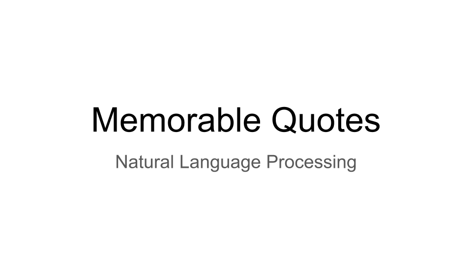

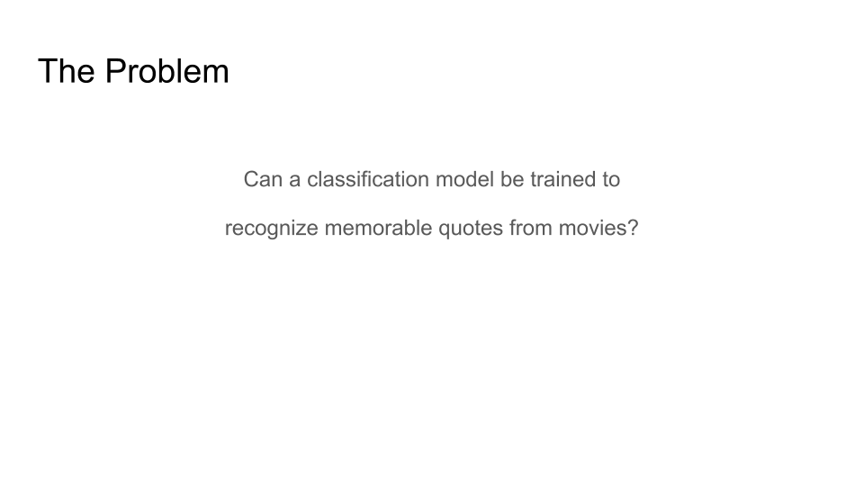

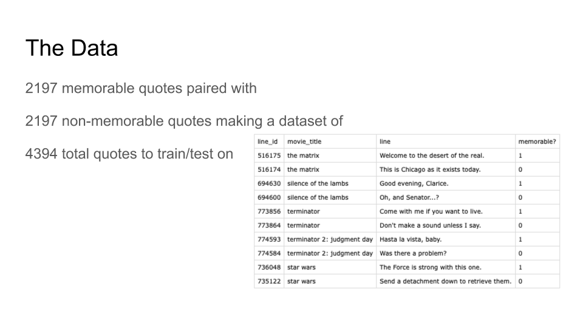

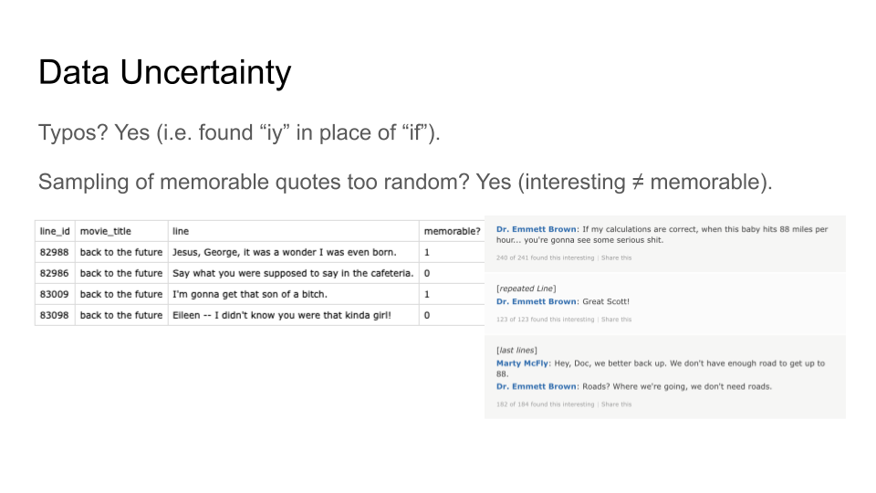

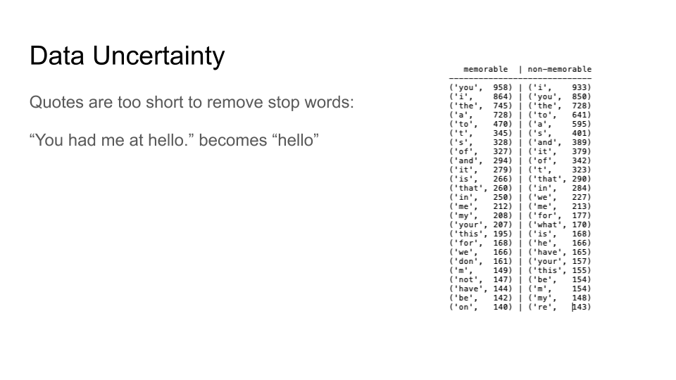

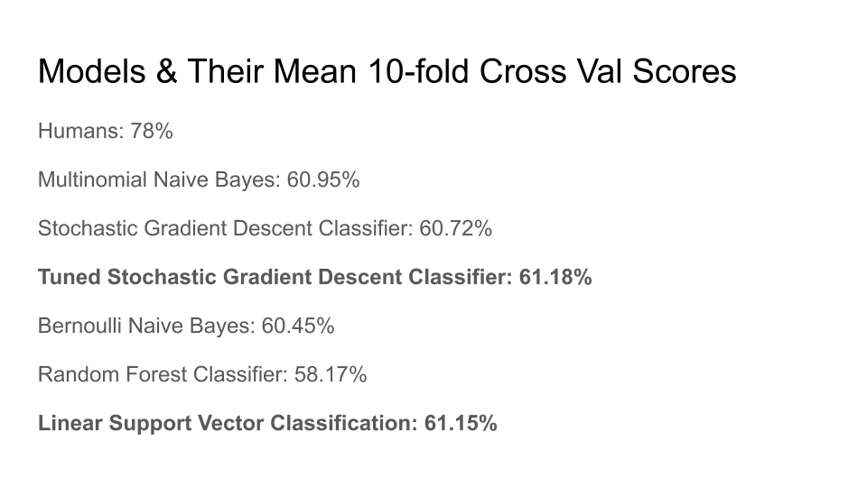

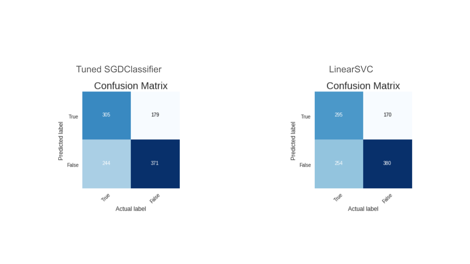

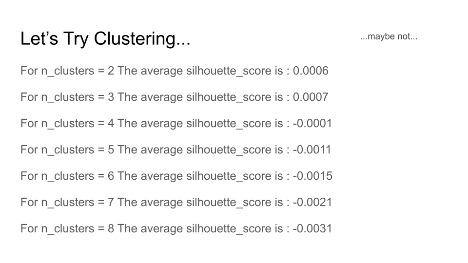

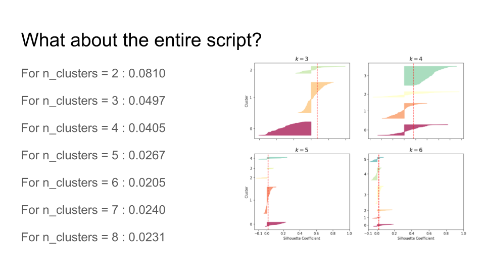

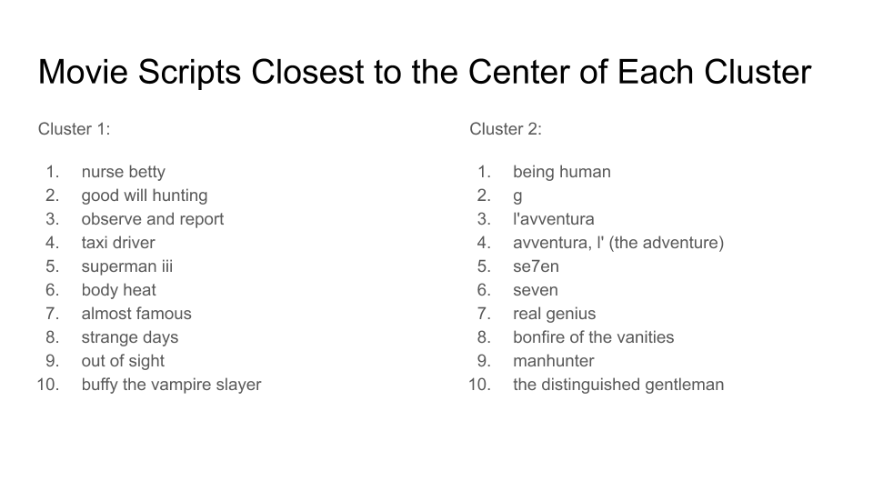

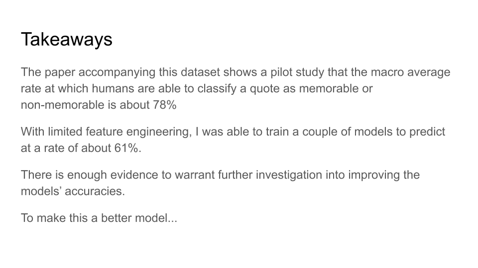

@InProceedings{Danescu-Niculescu-Mizil+al:12b,

  author={Cristian Danescu-Niculescu-Mizil and Justin Cheng and Jon Kleinberg and

  Lillian Lee},

  title={You had me at hello: {How} phrasing affects memorability},

  booktitle={Proceedings of ACL},

  year={2012},

  pages={892--901}

}
